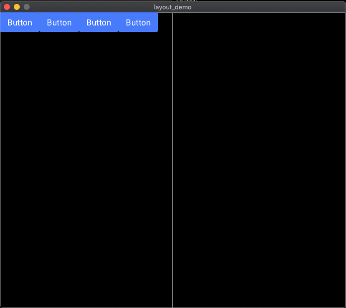
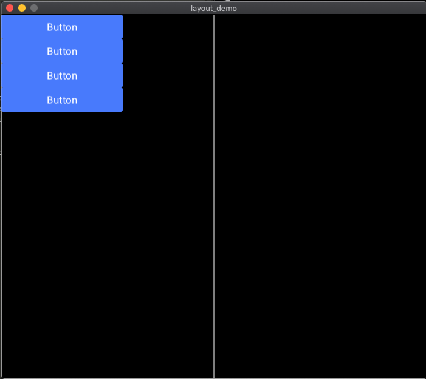

### Use Case 1:
Say in your scene you make an api request and want to render a component/primitive per response and display them in equally spaced rows and columns. With Scenic, you would have to know how many responses you would need, the {x,y} of each component factoring in any sort of spacing between. If you decide to change the position of these later, you will need to adjust each component individually. The is the exact case that the Layout-O-Matic was designed for and the example below would take care of that for you.

```elixir
@viewport Application.get_env(:my_app, :viewport)
            |> Map.get(:size)

  @grid %{
    grid_template: [{:equal, 2}],
    max_xy: @viewport,
    grid_ids: [:left, :right],
    starting_xy: {0, 0},
    opts: [draw: true]
  }

  @graph Graph.build()
         |> Scenic.Primitives.add_specs_to_graph(Grid.grid(@grid),
           id: :root_grid
         )
```

We start with our initial grid. This initial grid, in our case, will great 2 equally sized columns.
Grids in Layout-O-Matic are composed of a [group](https://hexdocs.pm/scenic/Scenic.Primitives.html#group/3) and a [rectangle](https://hexdocs.pm/scenic/Scenic.Primitives.html#rectangle/3). The function of a group is to provide a minimum {x,y} which the grid occupies. The additional function is to provide inhereted styles to the elements in the grid. The function of the rectangle is to provide a maximum {x,y} which the grid occupies. Additionally is can be optionally drawn. This can be useful to visualize your grid in development. The ids that are passed in are used to apply to the group and the rectangle. Group ids take the passed in id and append `_group` to the id to differentiate the two objects. The ids can, of course, be anything, although the intention is to make them as semantic as possible to easily add elements to grids or to set new grids within or relative to those.

Now that we have a grid in place we can add some elements. Taking us back to our example use case, lets take an api request to get some audio devices on a local network and display a [button](https://hexdocs.pm/scenic/Scenic.Components.html#button/3) per device so we can configure the device.

```elixir
def init(_, opts) do
  id_list = [
    :this_button,
    :that_button,
    :other_button,
    :another_button
  ]

  graph =
    Enum.reduce(id_list, @graph, fn id, graph ->
      graph
      |> Scenic.Components.button("Button", id: id, styles: %{width: 80, height: 40})
    end)

  {:ok, new_graph} = AutoLayout.auto_layout(graph, :left_group, id_list)
  {:ok, opts, push: new_graph}
end
```

From our api request we will declare some way to id each element. `id_list` will represent those ids. From there we decide to display a button per response so we generate a button per id in our `Enum.reduce` and will add those buttons to the graph. If we were to push this graph without doing any autolayout-ing, the buttons would not display as they have no {x,y}. This is where the Layout-O-Matic really comes in. Once we have our graph, grid, and ids we can pass those to `Component.Autolayout.auto_layout` which knows how to layout each component. What you get back is a new graph where your buttons are exactly spaced and fit within your grid. Now we push that graph and we can see them.



Now lets say we want to stack these buttons on top of each other. We have a few options here. We can decide we want to create a grid sized for just this stack of buttons. The grid will need to be a few pixels larger than our button size. The other option is to stick with our grid and adjust the size of the button. For this example lets try the latter option.

```elixir
def init(_, opts) do
  id_list = [
    :this_button,
    :that_button,
    :other_button,
    :another_button
  ]

  graph =
    Enum.reduce(id_list, @graph, fn id, graph ->
      graph
      |> Scenic.Components.button("Button", id: id, styles: %{width: 200, height: 40})
    end)

  {:ok, new_graph} = AutoLayout.auto_layout(graph, :left_group, id_list)
  {:ok, opts, push: new_graph}
end
```


